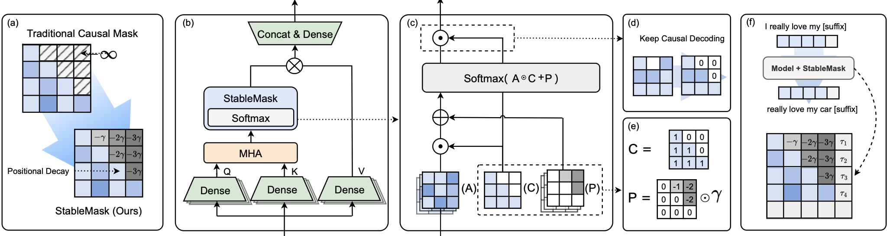

# StableMask: Refining Causal Masking in Decoder-only Transformer


> **StableMask: Refining Causal Masking in Decoder-only Transformer**\
> Qingyu Yin, Xuzheng He, Xiang Zhuang, Yu Zhao, Jianhua Yao, Xiaoyu Shen, Qiang Zhang\
> Paper: [https://arxiv.org/abs/2402.04779](https://arxiv.org/abs/2402.04779)

## News

**2024/05/02** 🔥 Our paper has been accepted by ICML'24! See you in Vienna!

**2024/02/10** 📖 We have uploaded our preprint to ArXiv!

## Abstract

The decoder-only Transformer architecture with causal masking and relative position encoding (RPE) has become the de facto choice in language modeling. Despite its exceptional performance across various tasks, we have identified two limitations: First, it prevents all attended tokens from having zero weights during the softmax stage, even if the current embedding has sufficient self-contained information. This compels the model to assign disproportional excessive attention to specific tokens. Second, RPE-based Transformers are not universal approximators due to their limited capacity atencoding absolute positional information, which limits their application in position-critical tasks. In this work, we propose StableMask: a parameter-free method to address both limitations by refining the causal mask. It introduces pseudo-attention values to balance attention distributions and encodes absolute positional information via a progressively decreasing mask ratio. StableMask’s effectiveness is validated both theoretically and empirically, showing significant enhancements in language models with parameter sizes ranging from 71M to 1.4B across diverse datasets and encoding methods. We further show that it supports integration with existing optimization techniques, making it easily usable in practical applications.

## Installation

### Pre-requirement

Python >= 3.8

### Required Package

```
cd StableMask
pip install -r requirements.txt
```

### Other requirements

- Linux
- NVIDIA A100/H100 GPU
- PyTorch 2.0+
- CUDA 12.0+

## Pretraining
Pretrain a toy example using the wikitext-103 dataset
```
bash train.sh
```

## Finetuning

## Inference

## Citation
Please cite:
```
@misc{yin2024stablemask,
      title={StableMask: Refining Causal Masking in Decoder-only Transformer}, 
      author={Qingyu Yin and Xuzheng He and Xiang Zhuang and Yu Zhao and Jianhua Yao and Xiaoyu Shen and Qiang Zhang},
      year={2024},
      eprint={2402.04779},
      archivePrefix={arXiv},
      primaryClass={cs.CL}
}
```
